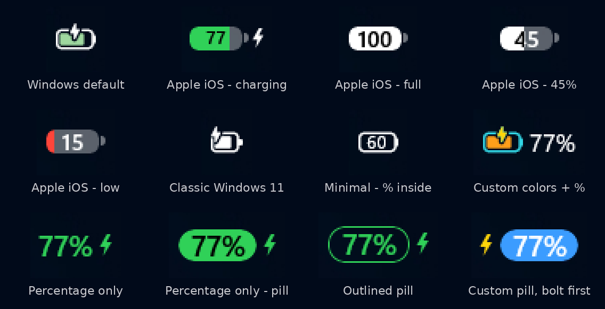

# Taskbar Battery Icon Customizer

A [Windhawk](https://windhawk.net) mod that restyles the Windows 11 taskbar
battery icon: Apple iOS or classic look, percentage only, your own colors,
size and spacing, all from simple dropdowns. No coding needed.



<sub>Some battery levels in the preview were captured with a simulated battery reading.</sub>

## Features

- **Quick looks**: one-click presets for Apple iOS (colored or single color),
  Classic Windows 11, Windows default with percentage, Minimal, and
  Percentage only (plain or in a colored pill).
- **Apple iOS style**: a solid pill with the percentage cut out of it. It turns
  green while charging, yellow in battery saver and red when low, and adapts to
  light and dark taskbars.
- **Classic style**: the older, compact single-color Windows 11 battery glyph.
- **Percentage only**: replace the icon with just the number. Choose the text
  size, weight and font (Segoe UI Variable, Segoe UI, Bahnschrift, Cascadia
  Code, Consolas), the % sign, a charging bolt before or after the number, and
  an optional colored or outlined pill behind it. It uses the same automatic
  or custom colors as the other styles.
- **Your own colors**: pick a color for each state (on battery, charging,
  plugged in, battery saver, low, very low), plus the outline and charging
  bolt, from a list, or enter any hex code.
- **Battery percentage**: left or right of the icon, or inside the battery.
- **Size and spacing**: scale, margins and vertical offset, so the icon lines
  up with the Wi-Fi and volume icons.
- Changes apply instantly, and disabling the mod restores the original icon.

## Requirements

- Windows 11 with the new colored battery icon (24H2/25H2 builds from late
  2025 onwards, where the tray lives in `SystemTray.dll`). Tested on Windows 11
  25H2, build 26200.
- [Windhawk](https://windhawk.net) 1.7 or newer.

## Install

1. Open Windhawk and click **Create a New Mod**.
2. Replace everything in the editor with the contents of
   [`battery-icon-customizer.wh.cpp`](battery-icon-customizer.wh.cpp).
3. Click **Compile Mod**, then **Exit Editing Mode**.
4. Open the mod's **Settings** tab, pick a **Quick look** and click
   **Save settings**.

## Settings

| Setting | What it does |
| --- | --- |
| **Quick look** | Ready-made looks. Choose *Build my own* to use the options below. |
| **Icon style** | Windows 11, Classic Windows 11, Apple iOS or Percentage only. |
| **Color mode** | *Automatic* (Windows / iOS colors), *Single color*, or *My own colors*. |
| **Colors** | A color per battery state, plus outline and charging bolt. Used with *My own colors*. |
| **Battery percentage** | Off, left, right or inside the icon; text size, bold, % sign and color. |
| **Percentage-only style** | Text size, weight and font, % sign, charging bolt position, and background (none, colored pill or outlined pill). |
| **Size and spacing** | Icon size (%), extra space left/right, and vertical offset. These apply to every look. |
| **Exact colors** | Hex codes (for example `#FF4545`) for any color set to *Custom*. |

## How it works

The tray battery icon is a `SystemTray.BatteryIconContent` XAML element made of
two stacked glyphs from the `SysBatt Fluent Icons` font: an outline and a
colored fill. The mod hooks the `IconView` constructor in `SystemTray.dll` to
catch the icon when the taskbar is created. It hides the system glyphs but
keeps them in the tree, so Windows keeps updating them, and draws its own
layers on top. Those layers mirror the system glyphs and react to changes.
Nothing is patched on disk.

### Developer helper

[`tools/install-local-mod.py`](tools/install-local-mod.py) compiles the mod
with Windhawk's bundled clang and registers it as a local mod, so you can
iterate without the Windhawk editor. Run it from an elevated prompt:

```
pip install pyyaml
python tools/install-local-mod.py battery-icon-customizer.wh.cpp --logging
```

## Credits

- Taskbar integration is based on
  [Taskbar tray system icon tweaks](https://windhawk.net/mods/taskbar-tray-system-icon-tweaks)
  by [m417z](https://github.com/m417z).
- Background on the new battery icon:
  [windhawk-mods discussion #3308](https://github.com/ramensoftware/windhawk-mods/discussions/3308).

## License

[GPL-3.0](LICENSE), the same license as the code it builds on.
